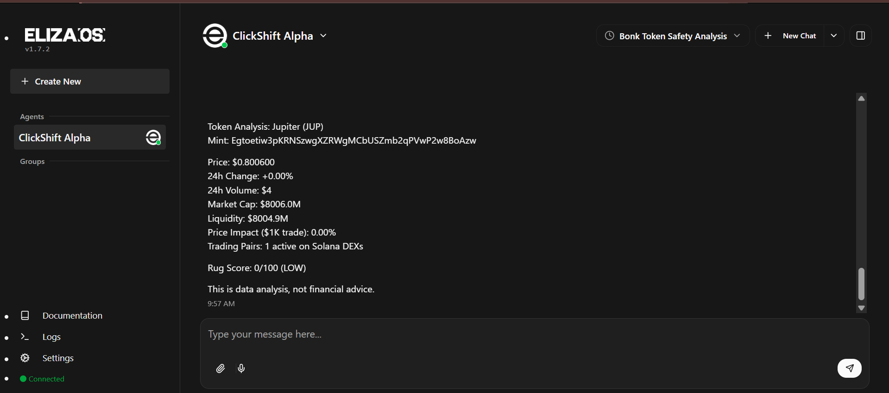

# ClickShift Alpha — DeFi Trading Intelligence Agent

> Built for the [Nosana x ElizaOS Builders Challenge](https://nosana.com/blog/builders-challenge-elizaos/) · April 2026

**ClickShift Alpha** is a DeFi trading intelligence agent that monitors Solana tokens, detects rug pulls, tracks smart money wallets, and provides portfolio analysis — all with **transparent reasoning** you can watch in real time.

Unlike typical chatbot wrappers, ClickShift Alpha shows you *how* it thinks. Every analysis step — from resolving a token symbol to checking mint authority to scoring risk — streams live through the Thought Stream panel. You don't just get an answer; you see the entire reasoning chain that produced it.



---

## Features

**Rug Pull Detection** — Queries RugCheck.xyz API to analyze mint authority, freeze authority, LP burn status, top holder concentration, and liquidity depth. Returns a scored risk assessment (LOW / MEDIUM / HIGH / CRITICAL) with explanations for each factor.

**Token Deep Analysis** — Pulls real-time price, volume, liquidity, market cap, and price impact data from DexScreener. Resolves token symbols to mint addresses automatically. Cross-references with rug scores for a complete picture.

**Wallet Tracking** — Monitors Solana wallets for recent transactions, identifies buy/sell patterns, and detects accumulation or distribution behavior. Stores tracked wallets in agent memory for ongoing alerts.

**Portfolio Monitoring** — Tracks your positions with live price updates and risk score changes. Proactively flags deteriorating risk scores or significant whale movements.

**Transparent Reasoning (Thought Stream)** — The agent's internal reasoning process streams to a real-time sidebar via Server-Sent Events. Watch the agent wake up, read context, reason through data, make decisions, and report results — all visible as it happens.

**Fact Extraction** — When you tell the agent "I hold 500 JUP," it automatically extracts and stores that information for future context. The agent remembers your portfolio and preferences across conversations.

---

## Architecture

```
┌─────────────────────────────────────────────────────────┐
│                    Frontend (Next.js)                     │
│         Chat UI  ·  Thought Stream  ·  Dashboard         │
└──────────────────────┬──────────────────────────────────┘
                       │ Socket.IO + REST
┌──────────────────────▼──────────────────────────────────┐
│                  ElizaOS v2 Runtime                       │
│     Character File  ·  Message Bus  ·  Memory  ·  RAG    │
└──────────────────────┬──────────────────────────────────┘
                       │
┌──────────────────────▼──────────────────────────────────┐
│              defi-intelligence Plugin                     │
│                                                          │
│  Actions          Providers         Evaluators            │
│  ├ CHECK_RUG      ├ portfolio       ├ riskAssessor        │
│  ├ ANALYZE_TOKEN  ├ marketData      └ factExtractor       │
│  ├ TRACK_WALLET   └ thoughtStream                        │
│  └ PORTFOLIO                        Services              │
│                                     └ SolanaRPC           │
│  Routes                                                  │
│  └ /api/defi/thought-stream (SSE)                        │
└──────────────────────┬──────────────────────────────────┘
                       │
         ┌─────────────┼─────────────┐
         ▼             ▼             ▼
   RugCheck.xyz   DexScreener   Solana RPC
```

### Plugin Components

| Component | Count | Purpose |
|-----------|-------|---------|
| **Actions** | 4 | Rug check, token analysis, wallet tracking, portfolio status |
| **Providers** | 3 | Portfolio context, market data, thought stream buffer |
| **Evaluators** | 2 | Post-response risk assessment, user fact extraction |
| **Services** | 1 | Persistent Solana RPC connection |
| **Routes** | 3 | SSE thought stream, REST thoughts API, health check |

### External APIs

| API | Auth Required | Purpose |
|-----|---------------|---------|
| [RugCheck.xyz](https://rugcheck.xyz) | No | Token security audits, rug scores |
| [DexScreener](https://dexscreener.com) | No | Price, volume, liquidity, pair data |
| Solana RPC | No | On-chain token info, wallet transactions |

---

## Tech Stack

- **Agent Framework**: [ElizaOS v2](https://docs.elizaos.ai/) — TypeScript multi-agent framework
- **LLM**: Qwen3.5-27B-AWQ-4bit (hosted endpoint provided by Nosana)
- **Frontend**: Next.js + Socket.IO + Server-Sent Events
- **Database**: PGLite (embedded PostgreSQL, zero-config)
- **Runtime**: Bun
- **Deployment**: Docker → Nosana decentralized GPU network

---

## Getting Started

### Prerequisites

- [Bun](https://bun.sh/) 1.1+
- [Docker](https://www.docker.com/) (for deployment)
- Git

### Local Development

```bash
# Clone your fork
git clone https://github.com/YOUR-USERNAME/agent-challenge
cd agent-challenge

# Set up environment
cp .env.example .env

# Install dependencies
bun install

# Install ElizaOS CLI
bun install -g @elizaos/cli

# Start in development mode
elizaos dev

# Open http://localhost:3000
```

### Docker (Local Testing)

```bash
# Build and run
docker compose up --build

# Or manually
docker build -t clickshift-alpha:latest .
docker run -p 3000:3000 clickshift-alpha:latest

# Open http://localhost:3000
```

### Deploy to Nosana

```bash
# Push to Docker Hub
docker tag clickshift-alpha:latest YOUR_USERNAME/clickshift-alpha:latest
docker push YOUR_USERNAME/clickshift-alpha:latest

# Deploy via Nosana CLI
nosana job post \
  --file ./nos_job_def/nosana_clickshift_alpha.json \
  --market nvidia-3090 \
  --timeout 30
```

Or deploy via the [Nosana Dashboard](https://deploy.nosana.com) — paste `nos_job_def/nosana_clickshift_alpha.json` and click Deploy.

See [DEPLOYMENT.md](./DEPLOYMENT.md) for the full step-by-step guide.

---

## Project Structure

```
├── src/
│   ├── character.ts                         # Agent personality + knowledge
│   ├── plugins/defi-intelligence/
│   │   ├── index.ts                         # Plugin manifest
│   │   ├── types.ts                         # Shared TypeScript types
│   │   ├── api/
│   │   │   ├── rugcheck.ts                  # RugCheck.xyz API client
│   │   │   ├── dexscreener.ts               # DexScreener API client
│   │   │   └── index.ts
│   │   ├── actions/
│   │   │   ├── checkRugScore.ts             # Rug pull risk analysis
│   │   │   ├── analyzeToken.ts              # Token deep analysis
│   │   │   ├── trackWallet.ts               # Wallet monitoring
│   │   │   └── portfolioStatus.ts           # Portfolio overview
│   │   ├── providers/
│   │   │   ├── portfolioProvider.ts          # Portfolio context injection
│   │   │   ├── marketDataProvider.ts         # SOL price + trending data
│   │   │   └── thoughtStreamProvider.ts      # Reasoning buffer
│   │   ├── evaluators/
│   │   │   ├── riskAssessor.ts              # Post-response risk flags
│   │   │   └── factExtractor.ts             # User holdings extraction
│   │   ├── services/
│   │   │   └── solanaService.ts             # Solana RPC connection
│   │   └── routes/
│   │       └── index.ts                     # SSE + REST endpoints
│   └── frontend/
│       ├── page.tsx                          # Main layout
│       ├── components/
│       │   ├── ChatPanel.tsx                 # Chat interface
│       │   └── ThoughtStream.tsx             # Real-time reasoning panel
│       ├── hooks/
│       │   ├── useElizaChat.ts              # Socket.IO messaging
│       │   └── useThoughtStream.ts           # SSE subscription
│       └── styles/
│           ├── globals.css                   # Design system
│           ├── Chat.module.css               # Chat styles
│           └── ThoughtStream.module.css      # Thought stream styles
├── nos_job_def/
│   └── nosana_clickshift_alpha.json          # Nosana deployment config
├── Dockerfile                                # Multi-stage Docker build
├── docker-compose.yml                        # Local dev compose
├── DEPLOYMENT.md                             # Full deployment guide
├── .env.example                              # Environment template
└── .env.production                           # Production defaults
```

---

## How the Thought Stream Works

The Thought Stream is the core differentiator. Here's how it flows:

1. **Actions emit thoughts** — Every action (`checkRugScore`, `analyzeToken`, etc.) calls `runtime.emit("thought_stream", { type, content })` at each reasoning step.
2. **Provider captures them** — The `thoughtStreamProvider` stores thoughts in a circular buffer and injects recent reasoning into the agent's context (so it's aware of its own chain of thought).
3. **SSE route pushes to frontend** — The `/api/defi/thought-stream` route maintains an SSE connection with the browser, pushing each thought as it arrives.
4. **Frontend renders in real time** — The `useThoughtStream` hook subscribes to the SSE endpoint and feeds entries to the `ThoughtStream` component with staggered animations.

Each thought is typed: `WAKE`, `READ`, `THINK`, `DECIDE`, `RESULT`, `RISK`, `SLEEP` — matching the heartbeat lifecycle of autonomous agent reasoning.

---

## Built By

**Emmanuel Ohanwe** — Building the intelligence that powers autonomous agents onchain.

- Website:         [clickshift.io](https://clickshift.io)
- My Twitter:      [@emmanuel_ohanwe](https://twitter.com/emmanuel_ohanwe)
- Company Twitter: [@clickshifhq](https://twitter.com/clickshifthq)
- GitHub:          [https://github.com/Clickshift-Founder/agent-challenge](https://github.com/Clickshift-Founder/agent-challenge)

---

## License

MIT License — see [LICENSE](./LICENSE) for details.
